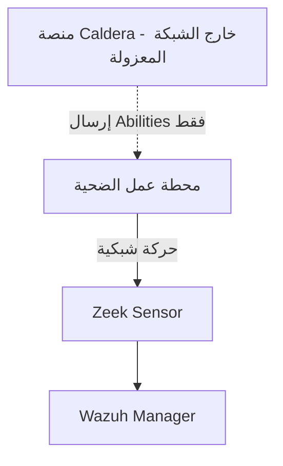

# مخططات الشبكة

ضع في هذا المجلد مخططات (بصيغة PNG أو Draw.io أو Mermaid) توضح بنية شبكة
المحاكاة المستخدمة في كل سيناريو، تشمل: الحاويات/الأجهزة الافتراضية،
اتصالات الشبكة الداخلية، ومواقع أجهزة الاستشعار (Zeek/Wazuh Agent).

## مثال بصيغة Mermaid

